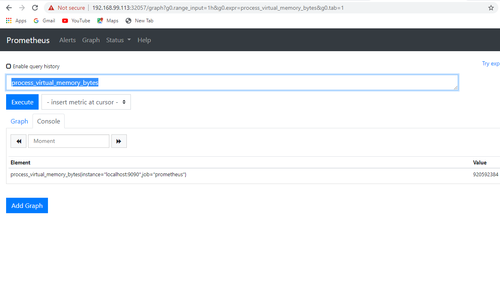
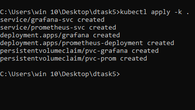
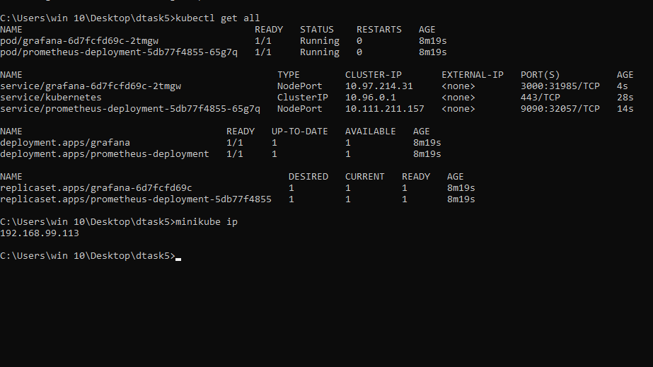

# Task5
# Task Overview
  
  Integrate Prometheus and Grafana and perform in 
  following way:

  1.  Deploy them as pods on top of Kubernetes by creating resources Deployment, ReplicaSet, Pods or Services
  2.  And make their data to be remain persistent 
  3.  And both of them should be exposed to outside world

# Kubernetes 
  Kubernetes is an open-source container-orchestration
  system for automating computer application deployment,
  scaling, and management. It was originally designed 
  by Google and is now maintained by the Cloud Native
  Computing Foundation.
  img src="k8s.jpg">
  
# Prometheus
  Prometheus is an open-source systems monitoring and
  alerting toolkit originally built at SoundCloud. 
  Since its inception in 2012, many companies and
  organizations have adopted Prometheus, and the 
  project has a very active developer and user community.
  

# Grafana
  Grafana is a multi-platform open source analytics and
  interactive visualization web application. It provides
  charts, graphs, and alerts for the web when connected
  to supported data sources. It is expandable through a
  plug-in system. End users can create complex monitoring
  dashboards using interactive query builders.
  
  
  Here we begin our task with Kubernetes, Prometheus and Grafana.
  
 
 # Step:1 
 Creating Persistent Volume for the Prometheus.
      
      apiVersion: v1
      kind: PersistentVolumeClaim
      metadata: 
        name: pvc-prom
        labels:
          name: pvcprometheus
      spec:    
        accessModes:
        - ReadWriteOnce
        resources:
          requests:   
           storage: 2Gi
           
 # Step:2
 Creating Service for exporting  the Prometheus.
     
     apiVersion: v1
     kind: Service
     metadata:
       name: prometheus-svc
       labels:
         app: prom-service
     spec:
       selector:
         app: prometheus
     type: NodePort
     ports:
     - nodePort: 32057
       port: 9090
       targetPort: 9090
       name: prometheus-port
     
 # Step:3
 Creating Deployment for the Prometheus.
  
    apiVersion: apps/v1
    kind: Deployment
    metadata:
      name: prometheus-deployment
    spec:
      replicas: 1
      selector:
        matchLabels: 
          tier: monitor
      template:
        metadata:
          labels:
            tier: monitor
        spec:
          containers:
          - name: prometheus-con
            image: prom/prometheus
       
            ports:
            - containerPort: 9090
       
            volumeMounts:
            - name: prometheus-vol
              mountPath: /data
      
         volumes:
         - name: prometheus-vol
           persistentVolumeClaim:
             claimName: pvc-prom

  # Step:4 
  Creating Persistent Volume for Grafana.
  
     apiVersion: v1
     kind: PersistentVolumeClaim
     metadata: 
       name: pvc-grafana
       labels:
         name: pvcgraf
     spec:
       accessModes:
         - ReadWriteOnce
     resources:
       requests:
         storage: 2Gi 
  
  # Step:5
  Creating Service for exporting Grafana.
  
      apiVersion: v1
      kind: Service
      metadata:
        name: grafana-svc
        labels:
          app: grafana-service
      spec:
        selector:
          app: grafana
        type: NodePort
        ports:
        - nodePort: 31985
          port: 3000
          targetPort: 3000
          name: port-grafana
  
# Step:6
Creating Deployment for Grafana.

    apiVersion: apps/v1
    kind: Deployment
    metadata:
      name: grafana
      labels: 
        app: graf
        tier: deploy
    spec:
      replicas: 1
      selector:
        matchLabels: 
          tier: monitoring
      template:
        metadata:
          labels:
            tier: monitoring
        spec:
          containers:
          - name: grafana-con
            image: grafana/grafana:latest
       
            ports:
            - containerPort: 3000
       
            volumeMounts:
            - name: grafana-vol
              mountPath: /var/lib/grafana
      
          volumes:
          - name: grafana-vol
            persistentVolumeClaim:
              claimName: pvc-grafana
              
 # Step:7
 Creating a kustomization file for the pod containing both Prometheus and Grafana.
 
     apiVersion: kustomize.config.k8s.io/v1beta1
     kind: Kustomization

    resources:
      - pvcprom.yml
      - grafpvc.yml
      - prom.yml
      - graf.yml 
      - promservice.yml  
      - grafservice.yml 

 Starting the Prometheus and Grafana services with Command.
            
     kubectl apply -k .
     
     
  
Checking all the services are Running.
     
     kubectl get all 

Here is our Prometheus WebUI.

WebUI for Grafana.

